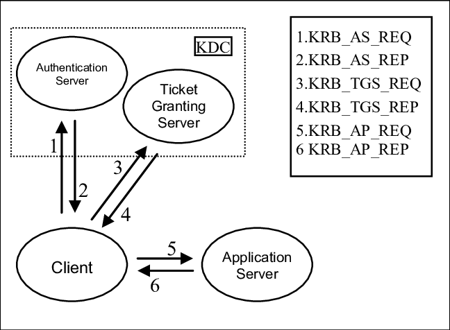

# Kerberos

Author [@rihemebh](https://github.com/rihemebh)

## What is Kerberos

Kerberos is a computer-network authentication protocol that works on the basis of tickets to allow nodes communicating over a non-secure network to prove their identity to one another in a secure manner. Its designers aimed it primarily at a client–server model, and it provides mutual authentication—both the user and the server verify each other's identity. Kerberos protocol messages are protected against eavesdropping and replay attacks.

-- Wikipedia

## Architecture



## What we will do ?

You will find in this repo a flask endpoint that needs kerberos authentication.

In order to test it you need to configure 3 machines : KDC, Client and Server then generate a token from the ticket produced by the KDC and everything will work properly

  --Note: in the rest of this document I will only use 2 machines one for the KDC and the other will work as server and client
  
## Prerequisite

- Docker
- Ubuntu image
- Python3
- Flask and Flask-Kerberos

## How it works?

1. Pull docker image  : ``docker pull ubuntu``
2. Create network bridge to create a private netwok between containers so they can communicate with each others  : ``docker network create --driver=bridge <network name>``
3. Create 2 containers from that image

Since the image doesn’t have any pre-installed dependencies you should first run :

```bash
apt update && apt upgrade 
```

then install whatever you need (in our case we'll need: nano,  host, ntp, ntpdate, python3, python3-pip )

## Machines' Setup

We will use ``insat.tn`` as domain name.

1. In each machine match different ips to their sub domain name in ``/etc/hosts``

    ```bash
    172.21.0.2      kdc.insat.tn kdc
    172.21.0.3      server.insat.tn server
    ```

    To test if everything is working properly try this command on each sub-domain:

    ```bash
    host kdc.insat.tn
    ```

2. Synchronize date between machines with ntp and ntpdate :

      - Why ?
        - Kerberos is time sensitive. It uses timestamps mechanism to check the validity of a ticket.Thus, we will create our own time server and synchronize all the machines.

      - On the Kdc machine edit the ``/etc/ntp.conf`` and add the lines below:

      ```bash
      restrict 127.0.0.1
      restrict ::1
      restrict 192.168.56.110 mask 255.255.255.0
      nomodify notrap
      server 127.127.1.0 stratum 10
      listen on *
      ```

      - On the server install ntp and ntpdate:

      ```bash
      apt install ntp
      apt install ntpdate
      ```

      - then edit the ``/etc/ntp.conf`` and add the lines below:

      ```bash
      pool ntp.ubuntu.com
      server 192.168.56.110
      server obelix
      ````

      - Synchronize time by running the below command on the server machine:

      ```bash
      ntpdate -dv 192.168.56.110
      ```

3. Configure KDC

```bash
apt install krb5-kdc krb5-admin-server krb5-config 
```

When it's prompted :
   -> realm : INSAT.TN
   -> kerberos server : kdc.insat.tn
   -> Administrative Service: kdc.insat.tn

- Create the realm: A Kerberos realm is the domain over which a Kerberos authentication server has the authority to authenticate a user, host or service.

```bash
krb5_newrealm
```

- Create principals and generate keytab:
  - A Kerberos Principal represents a unique identity in a Kerberos system to which Kerberos can assign tickets to access Kerberos-aware services.
  - The Kerberos Keytab file contains mappings between Kerberos Principal names and DES-encrypted keys that are derived from the password used to log into the Kerberos Key Distribution Center (KDC).

```bash
kadmin.local                              
addprinc root/admin                       
addprinc -randkey host/kdc.example.tn     
ktadd host/kdc.example.tn                 
```

### 4. Configure Server

```bash
apt install krb5-user libpam-krb5 libpam-ccreds
```

Then do the same thing for realm, kerberos service, administrative service

- Add host :

```bash
kadmin                                      
addprinc -randkey host/server.insat.tn     
ktadd host/server.insat.tn  
```

- Install Flask and Flask-Kerberos with pip

```bash
pip install flask
```

If you are using a docker image you should run those commands before installing flask kerberos:

```bash
apt-get install libkrb5-dev
apt-get install krb5-config
apt-get install libkrb5-dev
apt-get install libsasl2-dev
apt-get install libsasl2-modules-gssapi-mit
pip install requests_kerberos

pip install flask_kerberos

```

=>  Now your machines are ready to use the flask service

## Integrating Kerberos to a Flask Endpoint

 Since Kerberos is based on ticket granting and not passwords so we need first to grant a ticket for the user to access the service

### Tickets

 We have 2 types of tickets

- TGT (ticket granting ticket) : the ticket that will allow you to get tickets for services
- TGS (ticket granting service) allow you to access a service secured by kerberos

### Steps

 In order to test the endpoint you need to follow these steps:

 1. Generate a ticket : ``kinit``.
 2. Get the List of tickets with some details about them like expiration date : ``klist``.
 3. Change the diffrent domain names in files  "requestHandler" and "index" with your ones.
 4. Run the server ``./index.py``
 5. Execute the requestHandler.py file : its role is to generate a negotiate token and add the header to the url.

## References

- [https://ubuntu.com/server/docs/service-kerberos](https://ubuntu.com/server/docs/service-kerberos)
- [https://web.mit.edu/kerberos/krb5-1.12/doc/admin/admin_commands/kadmin_local.html](https://web.mit.edu/kerberos/krb51.12/doc/admin/admin_commands/kadmin_local.html)
- <https://github.com/hamza-mahjoub/flask-kerberos-module>
- <https://flask-kerberos.readthedocs.io/en/latest/>
