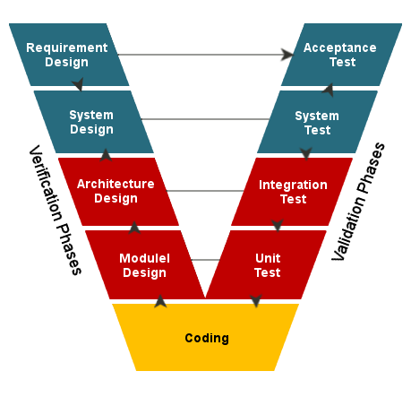

# Cheat sheet

## Fundamentals

### Software State

- Static : Test code for linting and style issues
- Dynamic : Test software functionality

### Importance of software testing

- No straight forward process
- Depends on software requirements
- Objectives :
  - prevents defects by evaluating requirements
  - verifies requirements fulfillment
  - verifies software behavior
  - find defects
  - comply with contract
- Tester roles :
  - review requirements and prevent ambiguity in definition
  - collaborate with dev to ensure requirements are understood and define tests
  - detect errors and report software readiness

### Error vs. Defect vs. Failure

- misunderstanding of a requirement , error -> invalid user story , defect -> wrong code, defect -> issues while running , failure
- error -> defect -> failure

### code defects

- Lack of skills
- Communication problems
- Time pressure
- Absence of clear test procedure

### Quality assurance QA vs Software testing

- Quality assurance, has as a process quality management, and within this quality management we can do software testing.
- Testing is part of QA

### FP & FN

- False positive : Tests fails due to an error unrelated to software like Data ( badly structured data ... ) , environment ( Wrong java version ... )
- False negative : Test is not detecting existing defects
- Input + Preconditions => Output , Defect related to Preconditions are hard to detect and reproduce

## Testing process and activities

### Defect types

- Ambiguity : parts of the specs are not clear
- Inaccuracy : parts of the specs lack accuracy, too general or too free
- Inconsistency : parts of the specs clash with each other

### TDD

Test driven development :

- Write unit tests before components and work to comply with those tests

### Test levels

- Components test
  - Separate Unit / Module tests
  - Objectives :
    - verify module functionality
    - prevent regression
    - Assure component quality
    - prevent defects from escaping to higher level ( Snowball effect )
  - Objects ( Targets ):
    - Class
    - Module
    - Function
    - Data structure
  - Detected defects :
    - Incorrect logic
    - Edge cases
- Integration test
  - focuses on data flow between components
  - finds defect on interactions between system parts
- System test

  - Validates the complete and fully integrated software product
  - Black box testing : The testing software has no idea what's inside the system
  - Objectives :
    - evaluate the end-to-end system specifications
    - check compliance between input and outputs

- Acceptance tests
  - black box test
  - performed by clients
  - final phase
  - validates businesses procedure
  - as close as possible to production environment

### Test process context

- Product risk
- Business domain
- operation constraints
- External / Internal policies
- SDLC : Software development lifecycle
  - SDLC has a big impact of software testing
  - Types :
    - Sequential :
      - Waterfall :
        - Requirement analysis
        - design
        - coding
        - testing
        - 
      - V-Model : For every activity there's a test level 
  - Iterative / Agile
    - Incremental testing
    - test activities overlap
    - test targets / object have minor changes which catches defects faster

### Test activities

#### Test planning

- Defines objectives
- Takes context into consideration
- Can be revisited after test monitoring

#### Test monitoring and control (always ongoing)

- monitoring : compares planned progress to actual progress
- control : take actions to meet objectives
  - assert coverage criteria
  - assert quality level
  - determine the need for more tests

#### Test analysis (what to test)

- Identify what to stets
- Spec / implementation / system, analysis
- defect identification : ambiguity, Inaccuracy, Inconsistency

#### Test design (how to test)

- identify needed resources ( Vms , database ...)
- identify needed data
- design test environment
- design test cases

#### Test implementation (do we have everything in place in order to execute tests?)

- prepare test software (testware)
- Code tests
- Use test suites
- Build test env

#### Test execution

- Run tests : Automated / Manual
- Record test execution
- compare results with expected results
- Reports ( coverage, failed tests)

#### Test Completion

- Summery
- determine if changes are needed
- gather reports

### Test Work products
